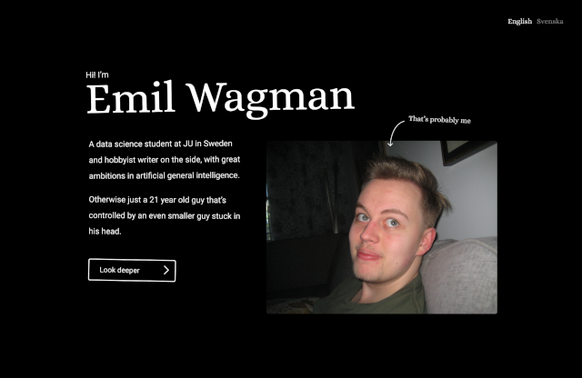

# EmilWagman.com 

Personal website meant to market myself to people and organizations. <a href="https://www.emilwagman.com/#/work/website" target="_blank">Article about this project</a>.



Built with <a href="https://svelte.dev" target="_blank">Svelte</a>. Designed with <a href="https://www.figma.com/" target="_blank">Figma</a>.

## Requirements

Please follow the appropriate instructions for your system.

- <a href="https://nodejs.org/en/download" target="_blank">Node.js</a>, Javascript runtime environment.

## Installation

    git clone https://github.com/Neobyte01/neobyte01.github.io
    cd neobyte.github.io
    npm install

## Usage

To run the website locally use the following command.

    npm run dev

Afterward the website can be found on the url: http://localhost:5173/

If the url doesn't work, check the terminal output from running ```npm run dev```(which should be kept running the whole time you want to access the website) for the url.