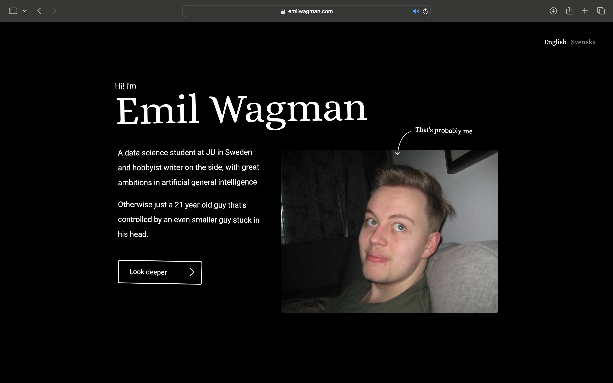

<div align="center">
  <a href="https://github.com/Neobyte01/neobyte01.github.io">
    
  </a>
  <h3 align="center">emilwagman.com</h3>
  <p align="center">Personal portfolio website</p>
</div>


## About The Project

This project was built as a future portfolio for projects I've worked on. It's built with Svelte, hosted with github-pages, and designed with Figma. The website is live on [emilwagman.com](https://www.emilwagman.com). An article about the project can be read [here](https://www.emilwagman.com/#/work/website).

## Screenshot



## How to use

To run this application, you'll need to have [Git](https://git-scm.com) and [Node.js](https://nodejs.org/en/) installed on your system.

From your command line:
```console
# Clone this repository.
git clone https://github.com/Neobyte01/neobyte01.github.io

# Go to directory.
cd neobyte.github.io

# Setup up node environment.
npm install

# Run application
npm run dev
```
Website can be accessed at `http://localhost:5173/

## License

Distributed under the MIT License. See [license](https://github.com/Neobyte01/WPLT/blob/main/LICENSE) for more information.
